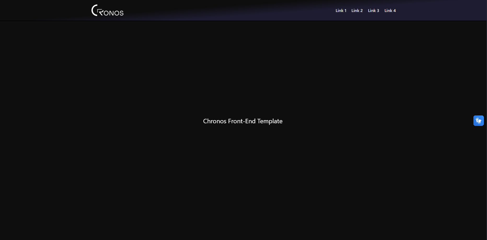

# 🧩 Chronos Front-End Template

> Template profissional para aplicações React com Tailwind CSS, criado pela [Chronos - Web Soluções](https://github.com/Chronos-Startup).

---

## 📸 Prévia



---

## 🚀 Sobre o Projeto

Este é o template oficial de Front-End da **Chronos**, desenvolvido com **React** e **Tailwind CSS**. Ele serve como ponto de partida para projetos web modernos e escaláveis.

O projeto já vem configurado com:

- Acessibilidade: Integração com **VLibras**;
- Qualidade de código: **ESLint** + **Prettier** prontos para uso.

---

## ⚙️ Tecnologias Utilizadas

- 🔹 [React](https://reactjs.org/)
- 🔹 [Vite](https://vitejs.dev/)
- 🔹 [Tailwind CSS](https://tailwindcss.com/)
- 🔹 [ESLint + Prettier](https://eslint.org/)
- 🔹 [VLibras](https://www.gov.br/governodigital/pt-br/acessibilidade)

---

## 🛠️ Como Usar

### 📥 1. Crie seu repositório a partir do template

1. Acesse o [template no GitHub](https://github.com/Chronos-Startup/nomedotemplate)
2. Clique no botão **`Use this template`**
3. Escolha a opção **`Create a new repository`**

#### 🖼️ Passo a passo ilustrado

**➊ Crie um novo repositório**


**➋ Clique em "Use this template"**

.png>)

**➌ Escolha a opção "Create a new repository"**

.png>)

---

### 💻 2. Clone o repositório

```bash
git clone https://github.com/seu-usuario/seu-novo-repositorio.git
cd seu-novo-repositorio
```

---

### 📦 3. Instale as dependências

```bash
npm install
```

---

### 🔧 4. Inicie o projeto localmente

```bash
npm run dev
```

---

## 📁 Estrutura de Pastas

```
src/
├── assets/         # Imagens e arquivos estáticos
├── components/     # Componentes reutilizáveis
├── pages/          # Páginas da aplicação
├── styles/         # Estilos globais (se necessário)
└── App.jsx         # Componente principal
```

---

## 🤝 Contribuições

Contribuições são super bem-vindas!  
Abra uma **issue**, sugira melhorias ou envie um **pull request**.

---

## 📄 Licença

Distribuído sob a Licença MIT. Veja o arquivo `LICENSE` para mais informações.

---

© 2025 Chronos. Todos os direitos reservados.
